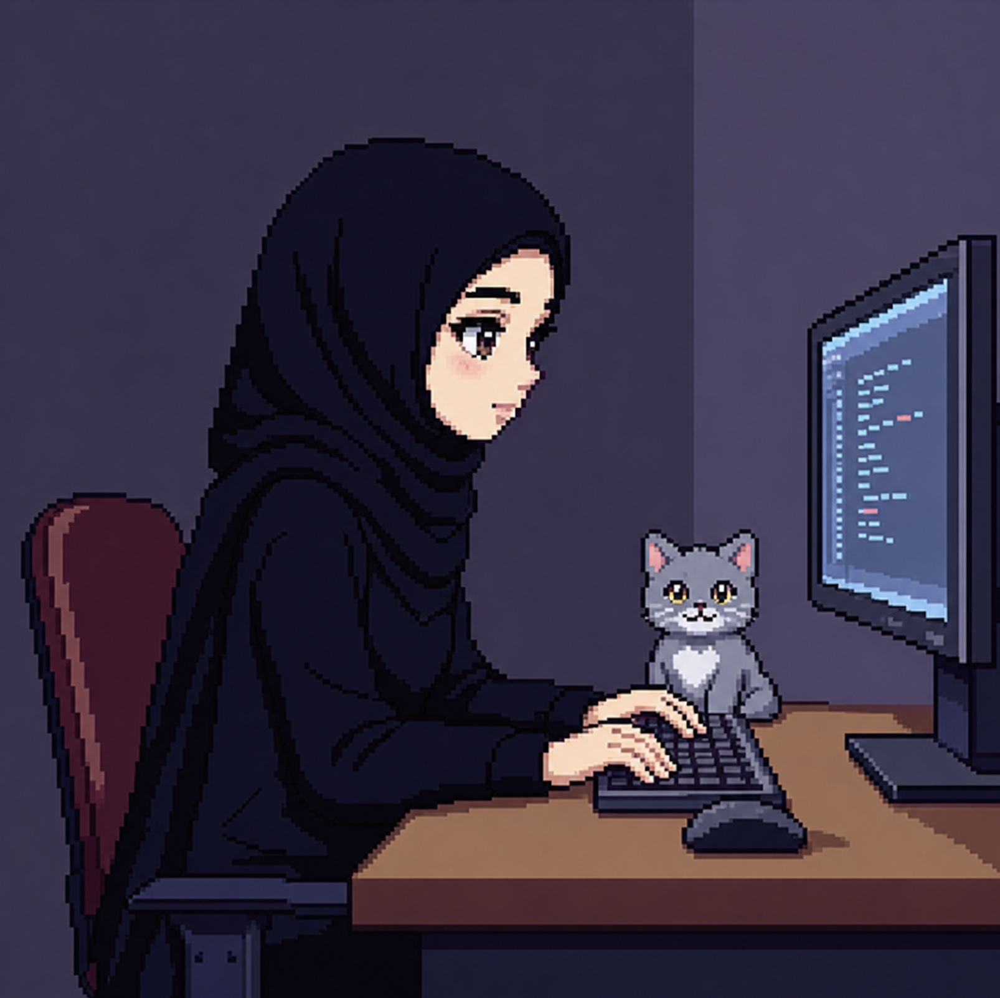

 

<table>
<tr>
<td width="38%" align="center" valign="middle">

</td>
<td width="62%" valign="middle">

## 𐙚 hello, i'm Saadat

Computer Engineering student at **Istanbul Technical University** interested in **software engineering**, **systems**, **algorithms**, and **open-source development**.

Currently building projects in **C/C++** and **JavaScript** while exploring **backend** and **systems programming**.

</td>
</tr>
</table>

---

### 𐙚 my current rule

*Nothing that is not serious gets to interrupt what is serious.*

---

## 𐙚 currently building my foundation in

|  |  |
|---|---|
| **Languages** | C · C++ · JavaScript |
| **Computer Science** | Data Structures · Algorithms · Problem Solving |
| **Development** | Git · GitHub · Open Source Workflow |
| **Web** | HTML · CSS · JavaScript |
| **Exploring** | Backend · Systems Programming |

---

## 𐙚 tools & languages

---

## 𐙚 what i'm working on

<table>
<tr>
<td width="33%" valign="top">

### 01 · code

Building a stronger foundation in C, C++, data structures, algorithms, and problem solving.

</td>
<td width="33%" valign="top">

### 02 · open source

Contributing through issues, documentation, pull requests, and collaborative development.

</td>
<td width="33%" valign="top">

### 03 · projects

Building software projects that explore algorithms, backend development, systems, and real-world problem solving.

</td>
</tr>
</table>

---

## 𐙚 github activity

---

learning gently · building consistently · improving one commit at a time

